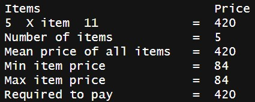

# R Statistics Project

The idea is to simulate a supermarket software cashier system to calculate statistics needed to improve the marketing strategies.

It begins by uploading a CSV file with three columns (items ID, price, quantity). You can either take the item ID manually by the keyboard or by scanning the QR code that translates into the integer item ID and when you finish you can enter 0 or scan a QR code with initialized 0. The statistics of the items bought then appear as a receipt

